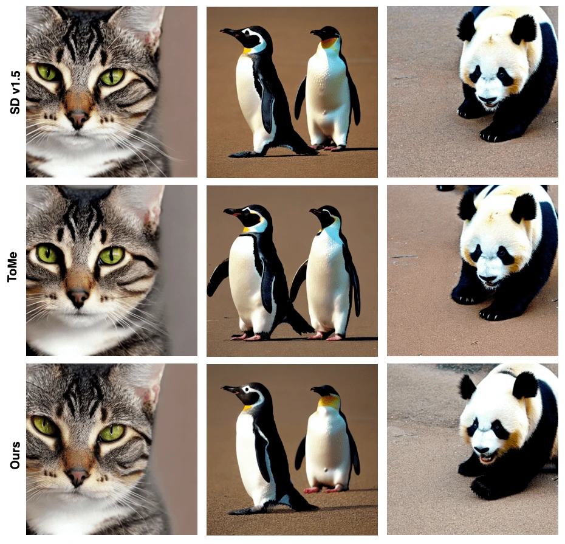
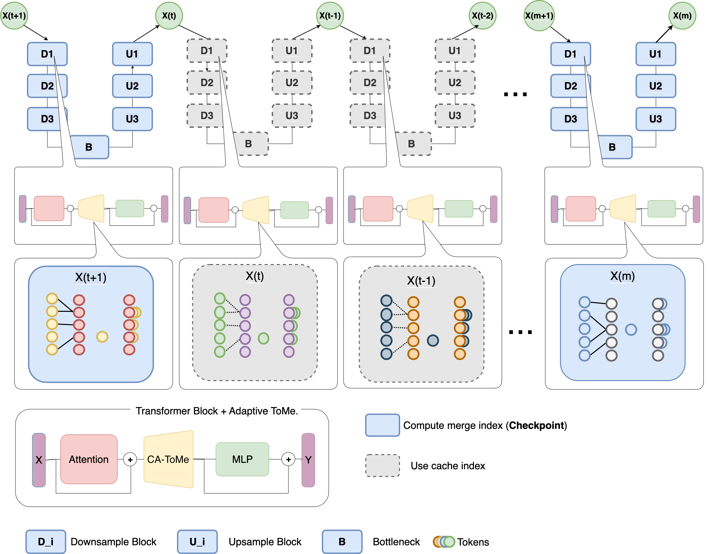

# Cached Adaptive Token Merging for Stable Diffusion 🎨✨



This is the official implementation of **[Cached Adaptive Token Merging: Dynamic Token Reduction and Redundant Computation Elimination in Diffusion Model](https://arxiv.org/abs/2303.17604)**  

[Omid Saghatchian](), [Atiyeh Gh. Moghadam](https://github.com/atiyehghm), Ahmad Nickabadi  

📁 _[GitHub](https://github.com/omidiu/ca_tome)_ | 📜 _[arXiv](https://arxiv.org/abs/2501.00946)_ | 📖 _[BibTeX](#citation)_

---

## CA-ToMe for Stable Diffusion 🚀🎨



Cached Adaptive Token Merging (**CA-ToMe**) combines two techniques to reduce spatial and temporal redundancy in diffusion models. 🌟 

- **Adaptive Token Merging**: Merges redundant tokens based on their similarity at each step, controlled by a threshold. 🔗 
- **Caching Mechanism**: Leverages temporal redundancy by storing similar pairs across adjacent steps. 🔐 

This training-free method achieves a speedup factor of **1.24x** during the denoising process while maintaining the same FID scores as existing approaches. 💡  
It can be applied to any diffusion model with transformer blocks, including Stable Diffusion models from the Diffusers library. 🛠️

---

## Results 📊

### Performance without Caching ⚡
Here are the results of **time (seconds)** and [FID](https://github.com/mseitzer/pytorch-fid) for different thresholds using Stable Diffusion v1.5 on a V100 GPU with 50 PLMS steps:

| Method                      | T  | FID ↓  | Time (s/im) ↓            |
|-----------------------------|----|:------|:--------------------------|
| **Baseline (Original Model)** | 1.0 | 34.23 | 7.51                      |
| **(w/Adaptive Merging)**     | 0.9 | 33.42 | 6.92 (**1.08x** _faster_) |
|                             | 0.8 | 33.80 | 6.58 (**1.14x** _faster_) |
|                             | 0.7 | 34.30 | 6.23 (**1.20x** _faster_) |
|                             | 0.6 | 35.56 | 6.10 (**1.23x** _faster_) |
|                             | 0.5 | 35.46 | 6.07 (**1.23x** _faster_) |
|                             | 0.4 | 35.28 | 6.07 (**1.23x** _faster_) |

---

### Performance with Caching 🔐⚡
| Method                      | T | Caching Config                   | FID ↓  | Time (s/im) ↓            |
|-----------------------------|----|----------------------------------|:------|:--------------------------|
| **Baseline (Original Model)** | -  | -                              | 33.66 | 7.61                      |
| **CA-ToMe**                  | 0.7 | [0, 1, 2, 3, 5, 10, 15, 25, 35] | 36.14 | 6.18 (**1.23x** _faster_) |
|                             | 0.7 | [0, 10, 11, 12, 15, 20, 25, 30, 35, 45] | 34.33 | 6.13 (**1.24x** _faster_) |
|                             | 0.7 | [0, 8, 11, 13, 20, 25, 30, 35, 45, 46, 47, 48, 49] | 34.05 | 6.09 (**1.25x** _faster_) |
|                             | 0.7 | [0, 9, 13, 14, 15, 28, 29, 32, 36, 45] | 34.82 | 6.12 (**1.24x** _faster_) |
|                             | 0.7 | [0, 1, 5, 7, 10, 12, 15, 35, 40, 45, 46-51] | 35.56 | 6.19 (**1.22x** _faster_) |
|                             | 0.7 | [0, 5, 10, 15, 20, 25, 30, 35, 40, 45, 50] | 35.20 | 6.14 (**1.23x** _faster_) |

---

## Installation 🛠️
```bash
pip install ca-tome
```

---

## Usage 🚀
```python
from diffusers import StableDiffusionPipeline
from caa_v333 import apply_CA_ToMe, CacheConf

pipe = StableDiffusionPipeline.from_pretrained(
    "stable-diffusion-v1-5/stable-diffusion-v1-5",
    cache_dir="model"
).to("cuda")

apply_CA_ToMe(pipe=pipe, cache_conf=CacheConf.CONFIG_3, r=0.8)

image = pipe.call("A high quality photograph of a cat").images[0]
image.save("cat.png")
```

🔔 **Note**: All experiments were conducted on the `runwayml/stable-diffusion-v1-5` model, which is no longer supported on Hugging Face. 

---

# Citation 🖍️
If you use **CA-ToMe** or this codebase in your work, please cite:
```bibtex
@article{ca_tome,
  title={Cached Adaptive Token Merging: Dynamic Token Reduction and Redundant Computation Elimination in Diffusion Model},
  author={Saghatchian, Omid and Moghadam, Atiyeh Gh. and Nickabadi, Ahmad},
  journal={arXiv preprint arXiv:2303.17604},
  year={2023}
}
